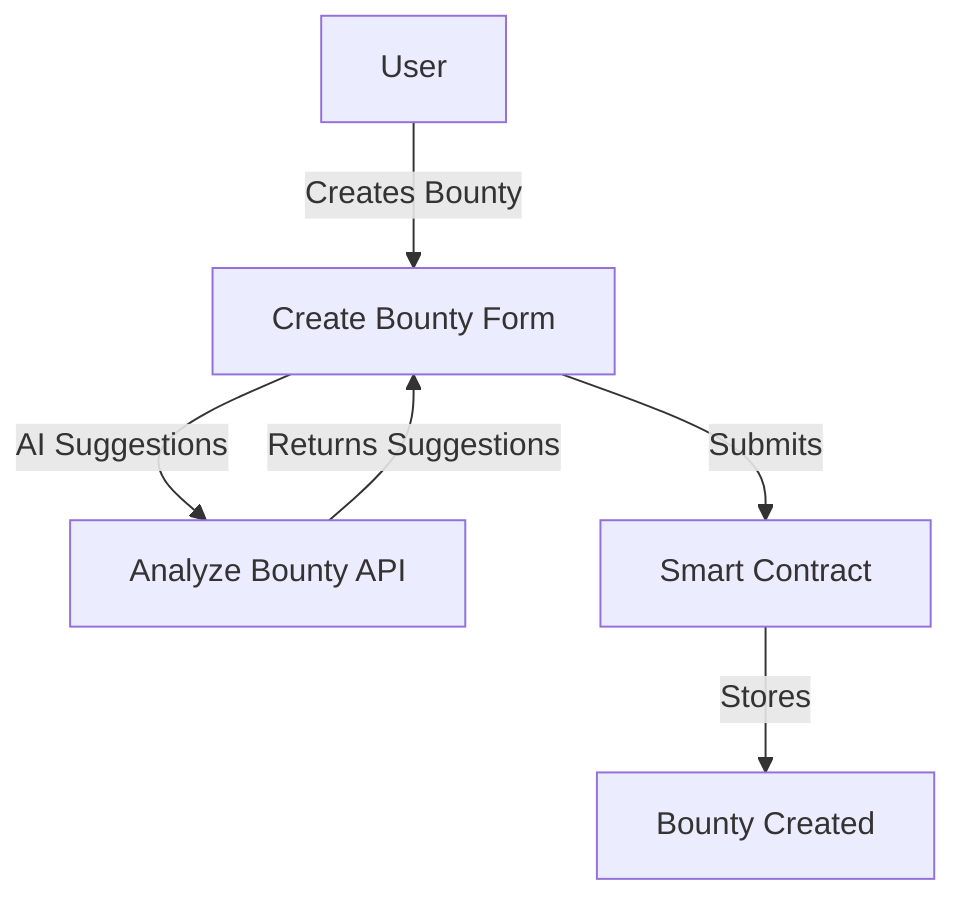
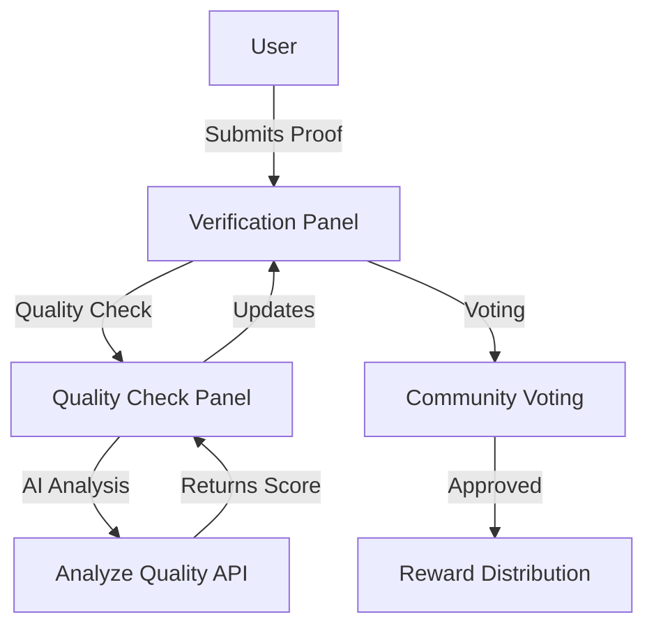
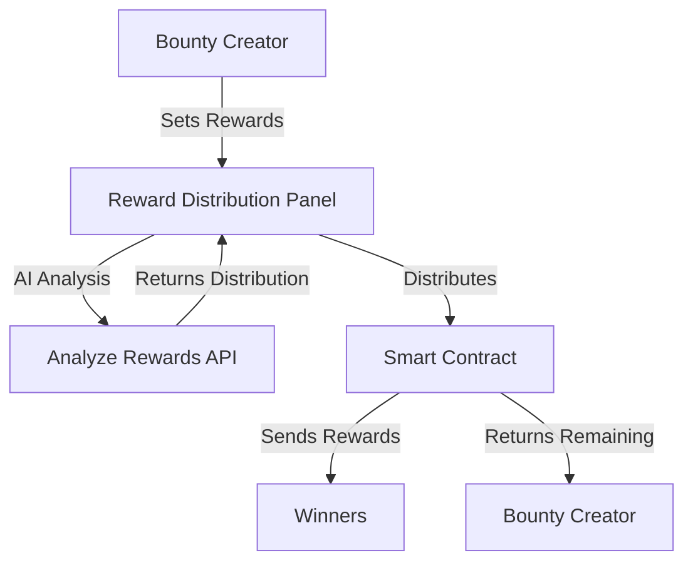

# Community Board - Decentralized Bounty Platform

A decentralized platform for creating, managing, and completing bounties with AI-powered features and community-driven verification.

## 📸 Visual Documentation

### Project Flow


### Submission Flow


### Reward Distribution Flow


#Smart Contract: 

https://edu-chain-testnet.blockscout.com/address/0x2C8e10de89319BEdD4535fe668B659e6e1dF5593


### Screenshots

#### Bounty Creation


*Create new bounties with AI-powered suggestions*

#### Submission Verification


*Community-driven verification with quality checks*

#### Reward Distribution


*Smart reward distribution with AI analysis*

#### Quality Check


*AI-powered quality assessment for submissions*

## 🌟 Features

### 1. AI-Powered Features
- **Smart Bounty Creation**: AI suggestions for bounty descriptions, requirements, and rewards
- **Quality Assessment**: AI-powered quality checks for submissions
- **Smart Reward Distribution**: AI analysis for fair reward distribution among multiple winners

### 2. Community-Driven Verification
- **Transparent Voting**: Community members vote on submissions
- **Quality Checks**: Accessible to all users for informed voting
- **Multiple Validation Layers**: Combines AI and community verification

### 3. Smart Contract Features
- **Secure Bounty Management**: Create, update, and complete bounties
- **Automated Rewards**: Smart distribution of rewards
- **Transaction Tracking**: Track all transactions on the blockchain

## 🛠️ Tech Stack

### Frontend
- Next.js
- TypeScript
- Tailwind CSS
- Ethers.js
- OpenAI API

### Smart Contract
- Solidity
- OpenZeppelin
- Hardhat

## 📋 Project Structure

```
CommunityBoard/
├── Frontend/
│   ├── components/
│   │   ├── create-bounty-form.tsx
│   │   ├── verification-panel.tsx
│   │   ├── quality-check-panel.tsx
│   │   ├── reward-distribution-panel.tsx
│   │   └── bounty-ai-suggestions.tsx
│   ├── pages/
│   │   └── api/
│   │       ├── analyze-bounty.ts
│   │       └── analyze-rewards.ts
│   └── types/
│       └── bounty.ts
└── SmartContract/
    └── contracts/
        └── CommuntyBoard.sol
```

## 🚀 Getting Started

### Prerequisites
- Node.js
- npm or yarn
- MetaMask wallet
- Sepolia testnet ETH

### Installation

1. Clone the repository:
```bash
git clone https://github.com/Vikash-8090-Yadav/CommunityBoard.git
cd CommunityBoard
```

2. Install dependencies:
```bash
cd Frontend
npm install
```

3. Set up environment variables:
```bash
cp .env.example .env.local
```
Add your OpenAI API key and other required variables to `.env.local`

4. Start the development server:
```bash
npm run dev
```

## 📝 Usage Guide

### Creating a Bounty
1. Connect your wallet
2. Click "Create Bounty"
3. Fill in bounty details
4. Use AI suggestions to enhance your bounty
5. Submit and fund the bounty

### Submitting to a Bounty
1. Find an active bounty
2. Submit your proof of completion
3. Wait for community verification
4. Receive rewards if approved

### Voting on Submissions
1. Review submission details
2. Use quality check for informed voting
3. Vote approve or reject
4. Track voting progress

## 🤝 Contributing

1. Fork the repository
2. Create your feature branch (`git checkout -b feature/AmazingFeature`)
3. Commit your changes (`git commit -m 'Add some AmazingFeature'`)
4. Push to the branch (`git push origin feature/AmazingFeature`)
5. Open a Pull Request

## 📄 License

This project is licensed under the MIT License - see the [LICENSE](LICENSE) file for details

## 👥 Authors

- @Vikash-8090-Yadav

## 🙏 Acknowledgments

- OpenZeppelin for smart contract templates
- OpenAI for AI capabilities
- The Ethereum community for support and resources
