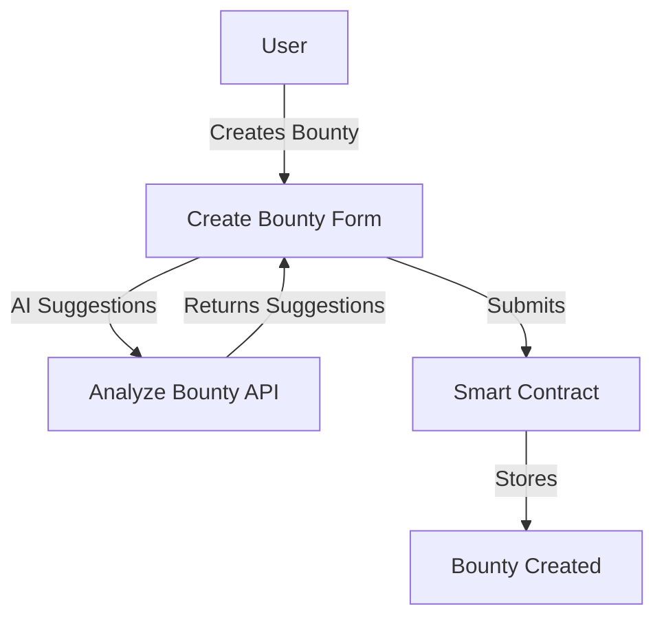
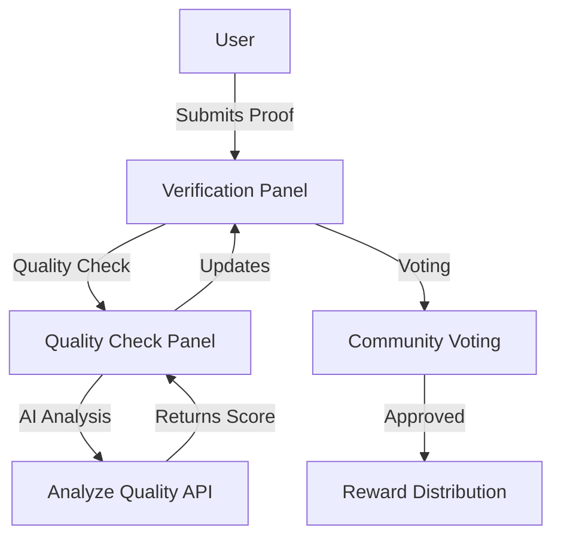
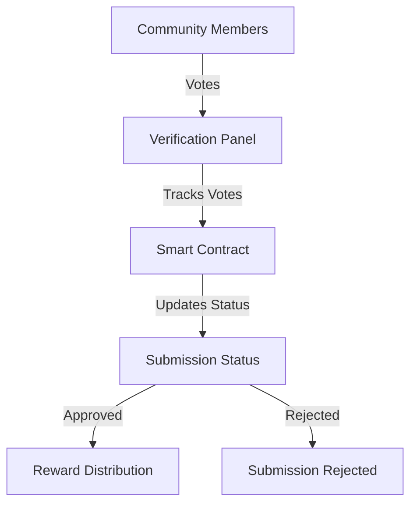
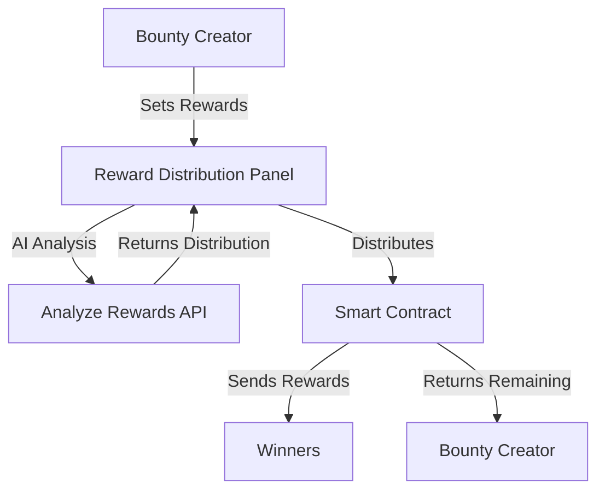
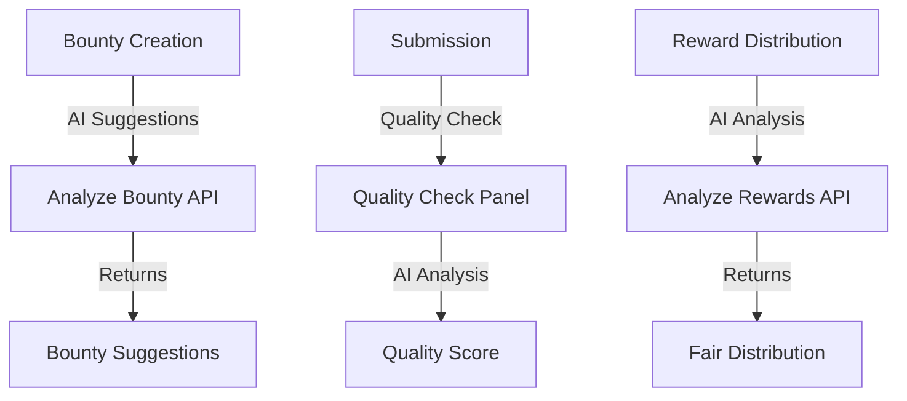

# Community Board Project Flow

## 1. Bounty Creation Flow

## 2. Submission Flow

## 3. Voting Flow

## 4. Reward Distribution Flow

## 5. AI Features Flow

## Key Components

### Frontend Components
1. `create-bounty-form.tsx` - Bounty creation with AI suggestions
2. `verification-panel.tsx` - Submission verification and voting
3. `quality-check-panel.tsx` - Quality assessment for submissions
4. `reward-distribution-panel.tsx` - Smart reward distribution
5. `bounty-ai-suggestions.tsx` - AI-powered suggestions

### API Endpoints
1. `analyze-bounty.ts` - Bounty creation suggestions
2. `analyze-rewards.ts` - Reward distribution analysis

### Smart Contract Features
1. Bounty creation and management
2. Submission handling
3. Voting system
4. Reward distribution
5. Transaction tracking

## User Roles
1. Bounty Creator
   - Creates bounties
   - Sets rewards
   - Completes bounties

2. Submitter
   - Submits proofs
   - Receives rewards
   - Can't vote on own submissions

3. Community Member
   - Votes on submissions
   - Quality checks
   - Participates in verification

## Key Features
1. AI-Powered Suggestions
   - Bounty creation assistance
   - Quality assessment
   - Reward distribution

2. Smart Voting System
   - Community-driven approval
   - Quality-based decisions
   - Transparent process

3. Automated Rewards
   - Smart distribution
   - Transaction tracking
   - Remaining reward return

4. Quality Assurance
   - AI-powered checks
   - Community verification
   - Multiple validation layers 